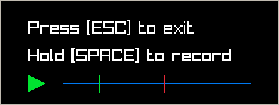

# Record and Playback

Record microphone input and play it back instantly for pronunciation practice in any language.
For learners who want immediate auditory feedback to compare and refine their speech.

<div align="center">
  
</div>

## Install

### Get Odin

Run
```console
./setup.sh
```

### Quick Start

```console
make release
./record-playback
```

### (Optional) Symlink

Symlink the executable to `/usr/local/bin` to make it available on PATH:
```console
sudo ln -s $PWD/record-playback /usr/local/bin
```
